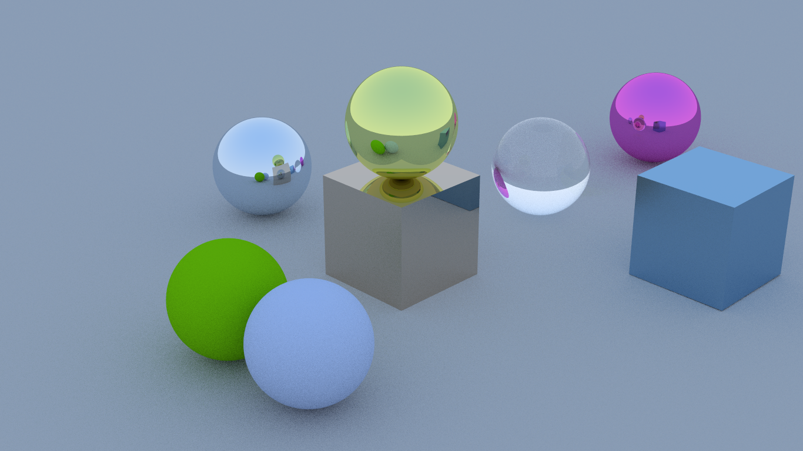
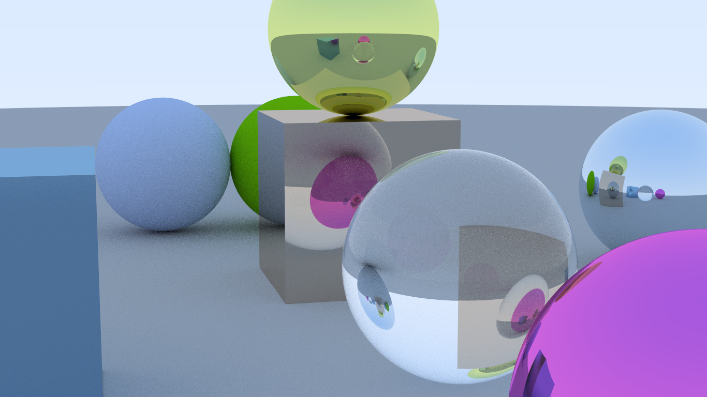

# Learn Ray Tracing in One Weekend Book Series

- Thank Peter Shirley very muck indeed for his [Ray Tracing in One Weekend Book Series][GitHub home].
- Thanks to [Ubpa dalao][Ubpa repo home] for his C++ code.

[GitHub home]:              https://github.com/RayTracing/raytracing.github.io/

[Ubpa repo home]:        https://github.com/Ubpa/RayTracingInOneWeekend

# 结果展示

- 视角1

- 视角2

- 视角2 实现焦点模糊

# 实现的功能

## 递归深度

- 递归深度设定为15，且可调节

## 一个像素的采样数

- 像素采样数设定为50，且可调节

## 材质

- Lambertian材质。Lambertian材质描述的表面是指在一个固定的照明分布下从所有的视场方向上观测都具有相同亮度的表面。实现原理为当光入射到表面，出射光的方向为表面法线所在的半圆，颜色衰减的大小取决于材质设定的数值。

- Metal材质。Metal材质描述的表面不会散射光，而只能反射光线。且反射光的方向可以进行扰动，扰动的程度由材质参数决定。

- Dielectric材质。Dielectric材质描述的表面满足斯涅尔定律。此表面可实现全反射和折射的效果。斯涅尔定律所要求的相对折射率由材质参数决定。

## 物体模型

- 球体
- 正方体